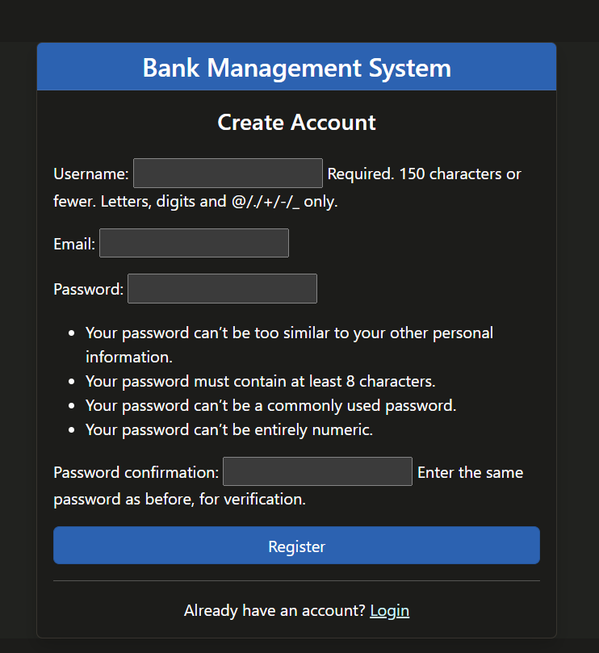
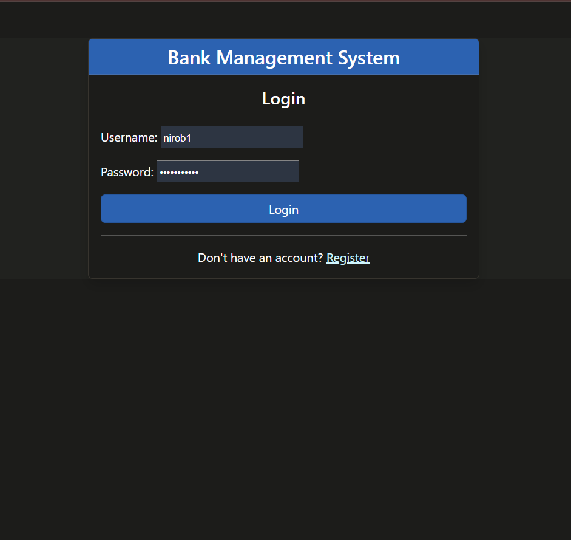
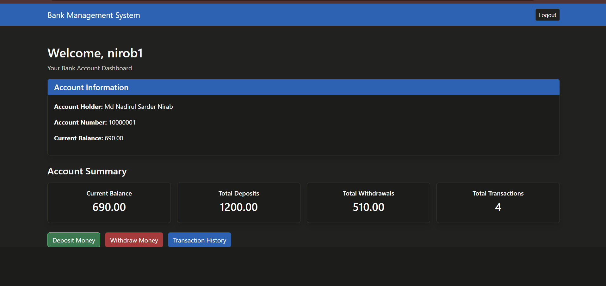
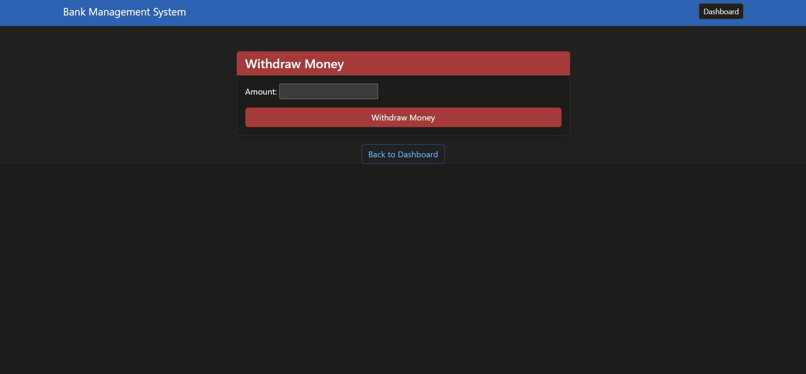
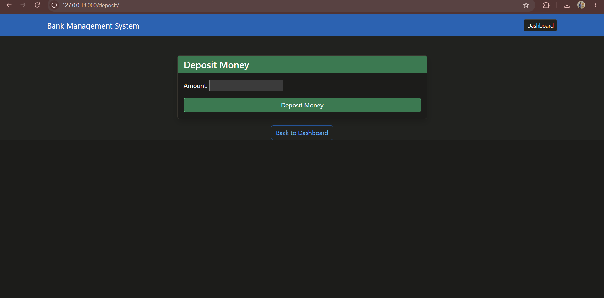
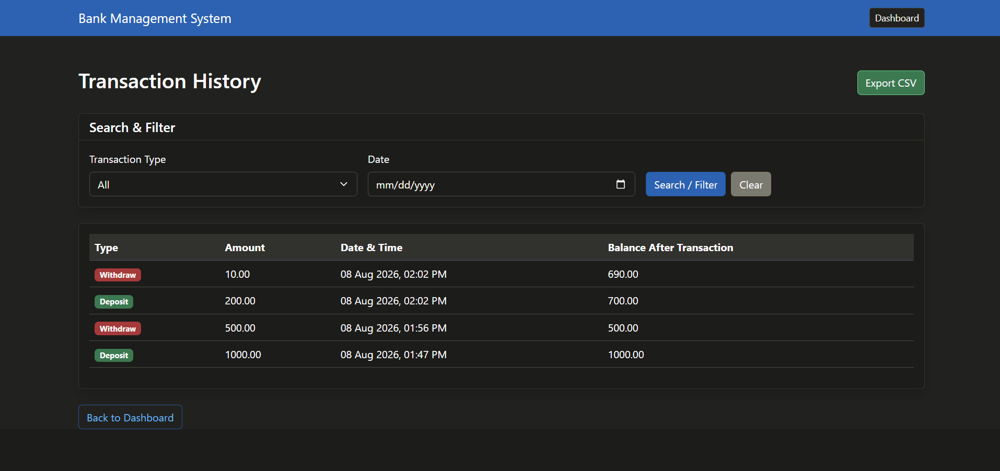

# Bank Management System

A web-based Bank Management System developed using Django. The system allows users to register, log in securely, create bank accounts, deposit and withdraw money, view transaction history, and manage their banking activities through a user-friendly Bootstrap interface.

## Features

### Main Features

* User Registration
* User Login
* User Logout
* Secure User Authentication
* Create Bank Account
* Deposit Money
* Withdraw Money
* Overdraft Prevention
* Transaction History
* Search and Filter Transactions
* Dashboard Statistics

### Bonus Features

* CSV Transaction Export
* Bootstrap UI

## Technologies Used

* Python
* Django
* SQLite
* HTML
* CSS
* Bootstrap
* Git & GitHub

## Project Setup

### 1. Clone the Repository

```bash
git clone YOUR_GITHUB_REPOSITORY_URL
cd bank-management-system
```

### 2. Create a Virtual Environment

```bash
python -m venv venv
```

### 3. Activate the Virtual Environment

#### Windows PowerShell

```powershell
.\venv\Scripts\Activate.ps1
```

### 4. Install Dependencies

```bash
pip install -r requirements.txt
```

### 5. Apply Database Migrations

```bash
python manage.py migrate
```

### 6. Run the Development Server

```bash
python manage.py runserver
```

Open the following URL in your browser:

```text
http://127.0.0.1:8000/
```

## Application Pages

| Page                | URL                     |
| ------------------- | ----------------------- |
| Login               | `/` or `/login/`        |
| Registration        | `/register/`            |
| Dashboard           | `/dashboard/`           |
| Create Bank Account | `/account/create/`      |
| Deposit             | `/deposit/`             |
| Withdraw            | `/withdraw/`            |
| Transaction History | `/transactions/`        |
| Export Transactions | `/transactions/export/` |
| Logout              | `/logout/`              |

## Screenshots

### 1. Registration



### 2. Login



### 3. Dashboard



### 4. Deposit / Withdraw




### 5. Withdraw


### 6. Transaction History



## Database

The project uses SQLite as the database.

The database contains information related to:

* Users
* Bank Accounts
* Deposits
* Withdrawals
* Transactions

A sample database is included with the project for demonstration purposes.

## Security

The system uses Django's built-in authentication system for user authentication and password security.

Users must log in before accessing protected banking features.

The system also prevents users from withdrawing more money than their available balance.

## CSV Export

Users can export their transaction history as a CSV file using the transaction export feature.

## Bootstrap UI

Bootstrap is used to provide a responsive and user-friendly interface throughout the application.

## How to Use

1. Open the application.
2. Register a new user account.
3. Log in using the registered credentials.
4. Create a bank account.
5. Deposit money into the account.
6. Withdraw money when required.
7. View transaction history.
8. Search and filter transactions.
9. Export transactions as a CSV file.

## Project Structure

```text
Bank Management System/
│
├── manage.py
├── db.sqlite3
├── requirements.txt
├── README.md
│
├── screenshots/
│   ├── registration.png
│   ├── login.png
│   ├── dashboard.png
│   ├── deposit-withdraw.png
│   └── transactions.png
│
├── templates/
│   └── ...
│
├── static/
│   └── ...
│
└── application/
    ├── models.py
    ├── views.py
    ├── urls.py
    └── ...
```

## Author

**Bank Management System Project**

Developed as an academic Django project.
